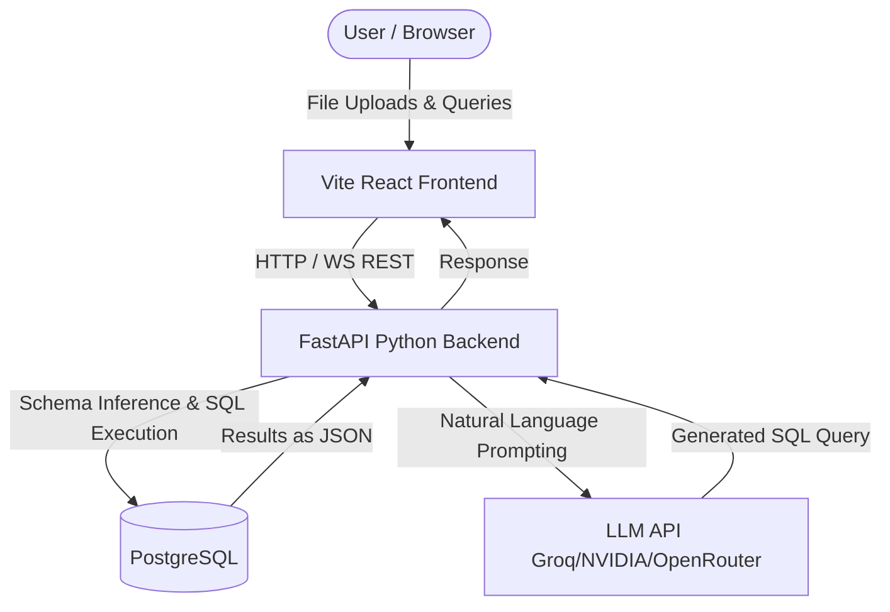

# 🧠 AI SQL Assistant
video: Task2
https://github.com/user-attachments/assets/73495c64-c3a5-47db-ab12-995608c5e076
> Upload any CSV or Excel dataset and query it in **plain English**. Powered by Groq / NVIDIA / OpenRouter LLMs and PostgreSQL.

---

## ✨ Features

| | |
|---|---|
| 📁 **Dataset Upload** | Drag & drop CSV / Excel files up to 50 MB |
| 🔍 **Schema Detection** | Automatically infers column types & creates PostgreSQL tables |
| 💬 **Natural Language** | Ask questions in plain English |
| ⚡ **SQL Generation** | LLM converts questions to safe, optimised PostgreSQL |
| 🛡️ **SQL Validation** | Multi-layer AST validation prevents destructive operations |
| 📜 **Query History** | Browse & replay past queries |
| 📤 **Export** | Download results as CSV directly in the browser |
| 🔌 **Multi-provider LLM** | Groq · NVIDIA NIM · OpenRouter · Gemini · OpenAI |

---

## 🚀 Quick Start — Docker (recommended)

### Prerequisites
- [Docker](https://docs.docker.com/get-docker/) ≥ 24 with the Compose plugin
- An API key for your chosen LLM provider (Groq is free & fast)

### 1. Clone

```bash
git clone https://github.com/your-username/aisql.git
cd aisql
```

### 2. Configure environment

```bash
cp .env.example .env
```

Open `.env` and set at minimum:

```dotenv
LLM_PROVIDER=groq            # groq | nvidia | openrouter | gemini | openai
GROQ_API_KEY=gsk_...         # only the key for your chosen provider is required
SECRET_KEY=<random-32-chars>
```

Generate a secret key:

```bash
python -c "import secrets; print(secrets.token_hex(32))"
```

### 3. Build & start

```bash
docker compose up -d --build
```

| Service | URL |
|---|---|
| **Frontend** | http://localhost:3000 |
| **Backend API** | http://localhost:8000 |
| **API Docs** | http://localhost:8000/docs *(only when DEBUG=true)* |

### 4. Tear down

```bash
docker compose down          # stop containers (keeps volumes)
docker compose down -v       # stop + delete all data
```

---

## 💻 Local Development (without Docker)

### Prerequisites
- Python 3.11+
- Node.js 22+
- PostgreSQL 16+ running locally (or use `make db-start` for Docker)
- [`uv`](https://docs.astral.sh/uv/getting-started/installation/) package manager

### 1. Start PostgreSQL

```bash
make db-start          # spins up postgres in a Docker container on port 5432
```

### 2. Backend

```bash
cd backend
cp ../.env.example .env   # edit and fill in your keys
make install-backend       # uv sync
make dev-backend           # http://localhost:8000
```

### 3. Frontend

```bash
cd frontend
make install-frontend      # npm install
make dev-frontend          # http://localhost:5173
```

---

## 📁 Project Structure

```
aisql/
├── backend/                  # FastAPI + Python 3.11
│   ├── app/
│   │   ├── api/              # REST endpoints (datasets, chat, queries, export)
│   │   ├── models/           # SQLAlchemy ORM models
│   │   ├── schemas/          # Pydantic request / response schemas
│   │   ├── services/         # Business logic (LLM, file processor, executor …)
│   │   ├── security/         # Rate limiting & SQL sanitisation
│   │   └── utils/            # Helpers & exceptions
│   ├── scripts/
│   │   └── init_db.sql       # PostgreSQL roles + schemas bootstrap
│   ├── tests/                # pytest test suite
│   ├── Dockerfile            # Multi-stage Python image
│   └── pyproject.toml
│
├── frontend/                 # Vite + React 19 + TypeScript
│   ├── src/
│   │   ├── components/       # UI components (chat, upload, results, layout …)
│   │   ├── hooks/            # TanStack Query hooks
│   │   ├── services/         # Axios API client
│   │   └── types/            # TypeScript interfaces
│   ├── Dockerfile            # Multi-stage Node → nginx image
│   └── nginx.conf            # Reverse-proxy /api → backend
│
├── sample_data/              # Demo CSV files to try
├── docs/                     # Architecture & API documentation
├── docker-compose.yml        # Full-stack orchestration
├── .env.example              # Annotated environment template
└── Makefile                  # Dev workflow shortcuts
```

---

## 🔑 Environment Variables

| Variable | Description | Default |
|---|---|---|
| `LLM_PROVIDER` | `groq` · `nvidia` · `openrouter` · `gemini` · `openai` | `groq` |
| `GROQ_API_KEY` | API key for Groq (model: `llama-3.3-70b-versatile`) | — |
| `NVIDIA_API_KEY` | API key for NVIDIA NIM (model: `meta/llama-3.1-70b-instruct`) | — |
| `OPENROUTER_API_KEY` | API key for OpenRouter (model: `meta-llama/llama-3.3-70b-instruct:free`) | — |
| `OPENAI_API_KEY` | API key for OpenAI (model: `gpt-4o`) | — |
| `GEMINI_API_KEY` | API key for Google Gemini (model: `gemini-1.5-pro`) | — |
| `DB_PASSWORD` | PostgreSQL password for `aisql_app` user | `dev_password` |
| `QUERY_DB_PASSWORD` | PostgreSQL password for read-only `aisql_query` user | `query_password` |
| `SECRET_KEY` | Random secret for signing (min 32 chars) | *(required)* |
| `DEBUG` | Enable `/docs` & `/redoc` in the backend | `false` |
| `MAX_UPLOAD_SIZE_MB` | Maximum file upload size | `50` |
| `QUERY_TIMEOUT_SECONDS` | SQL execution timeout | `30` |
| `RATE_LIMIT` | API rate limit | `60/minute` |
| `FRONTEND_PORT` | Host port for the frontend container | `3000` |
| `BACKEND_PORT` | Host port for the backend container | `8000` |
| `DB_PORT` | Host port for PostgreSQL | `5432` |

---

## 📡 API Reference

Interactive docs: **http://localhost:8000/docs** *(requires `DEBUG=true`)*

| Method | Endpoint | Description |
|---|---|---|
| `GET` | `/health` | Health check |
| `POST` | `/api/v1/datasets/upload` | Upload CSV / Excel file |
| `GET` | `/api/v1/datasets` | List all datasets (paginated) |
| `GET` | `/api/v1/datasets/{id}` | Get single dataset |
| `GET` | `/api/v1/datasets/{id}/preview` | Preview first N rows |
| `DELETE` | `/api/v1/datasets/{id}` | Delete dataset & table |
| `POST` | `/api/v1/chat` | Natural language → SQL → results |
| `GET` | `/api/v1/queries/history` | Paginated query history |
| `GET` | `/api/v1/queries/{id}` | Single query detail |

---

## 🧪 Example Queries

After uploading `sample_data/sales_orders.csv`, try:

- *"Show top 10 orders by total amount"*
- *"Which month generated the highest sales revenue?"*
- *"Find all orders where quantity is greater than 10"*
- *"What is the average order value by region?"*
- *"Find duplicate order IDs"*
- *"Which salesperson has the highest total revenue?"*

---

## 🛡️ Security

Defence-in-depth approach:

1. **Input validation** — file type / size limits, query length limits, rate limiting
2. **Prompt guardrails** — system prompt restricts the LLM to `SELECT`-only output
3. **SQL AST validation** — `sqlparse` checks statement type, blocked keywords, table references
4. **Database isolation** — read-only `aisql_query` role executes user queries; DDL is impossible
5. **Container hardening** — non-root user in the backend image, health checks on all services

---

## 🔧 Make Commands

```bash
make help            # list all commands
make dev-backend     # start FastAPI with hot reload
make dev-frontend    # start Vite dev server
make test            # run pytest
make lint            # run ruff linter
make format          # run ruff formatter
make db-start        # start PostgreSQL via Docker
make db-stop         # stop PostgreSQL container
make db-reset        # wipe & recreate database (destructive!)
make docker-up       # docker compose up --build -d
make docker-down     # docker compose down
```

---

## 📦 Mandatory Deliverables Submission

Below is the required documentation addressing the mandatory deliverables for this project submission.

### 1. Source Code Repository
**Included in Submission:** The complete codebase containing the React frontend, FastAPI backend, and PostgreSQL configurations.

### 2. Database Schema
**Included in Submission:** Found in `backend/app/models/` and dynamic user tables.
- **Dynamic Tables:** Automatically generated from uploaded CSV/Excel files (stored in `user_data` schema).
- **History/Sessions:** System tables to track query history and user interactions.

### 3. README with Setup Instructions
**Included in Submission:** This document serves as the setup instruction guide. (See [Quick Start](#-quick-start--docker-recommended) above).

### 4. API Documentation
**Included in Submission:** The backend REST API endpoints are logically structured and accessible interactively.
- Interactive Swagger UI: `http://localhost:8000/docs` (when `DEBUG=true`)
- Endpoints for `datasets/upload`, `chat`, `queries/history`, etc.

### 5. Sample Dataset(s)
**Included in Submission:** Found in the `sample_data/` directory.
- `sales_orders.csv` is included to quickly test schema detection and natural language SQL generation.

### 6. Screenshots or Demo Video
**Project Demo Video:**
<video width="100%" controls>
  <source src="https://github.com/Hari-Oggy/Harveedesigntasks/raw/main/aisql/video/Screencast%20from%202026-07-11%2018-41-23.mp4" type="video/mp4">
  Your browser does not support the video tag.
</video>

---

### 7. Brief Architecture Document

#### Architecture Design
The system utilizes a decoupled frontend-backend architecture with dynamic database interactions.



#### Database Design Decisions
- **Schema Separation**: System data is separated from user-uploaded data. Uploaded CSVs are dynamically loaded into a dedicated `user_data` schema to prevent namespace collisions.
- **Dynamic Typing**: The backend infers SQL types (VARCHAR, INT, FLOAT) from the dataset to ensure optimized querying.
- **Role Isolation**: The application utilizes a read-only PostgreSQL role (`aisql_query`) to execute user-generated SQL, ensuring complete isolation from DDL capabilities.

#### AI Integration Approach
- **Multi-Provider LLM Integration**: Supports Groq, NVIDIA NIM, OpenRouter, Gemini, and OpenAI.
- **Schema Context Injection**: The backend extracts the dynamic table schema (columns and types) and injects it into the prompt to ensure the LLM generates accurate SQL specific to the dataset.
- **System Guardrails**: The prompt restricts the LLM to outputting only `SELECT` statements, mitigating the risk of hallucinated structural changes.

#### Security Considerations
- **SQL Injection Prevention**: Instead of blindly executing LLM output, a multi-layer AST validation using `sqlparse` checks the statement type, blocks destructive keywords (DROP, DELETE, UPDATE), and verifies table references.
- **Database Level Security**: Using a strictly read-only role (`aisql_query`) guarantees that even if a destructive query bypasses AST validation, the database engine will reject it.
- **Input Sanitization**: File type and size limits (50 MB default) protect against malicious uploads and resource exhaustion.

#### Challenges Faced and Solutions Implemented
- **Challenge:** LLMs generating destructive or invalid SQL queries (e.g., trying to `DROP TABLE` or referencing non-existent columns).
- **Solution:** Implemented a robust two-layer defense mechanism. First, Python-side AST parsing explicitly rejects non-SELECT queries. Second, database-level role restrictions (read-only) provide an unbypassable safeguard against data modification.
- **Challenge:** Handling arbitrary CSV/Excel structures without predefined schemas.
- **Solution:** Developed an automated schema inference module that scans the dataset, standardizes column names (snake_case), infers data types via Pandas, and dynamically constructs the SQL schema on the fly.

